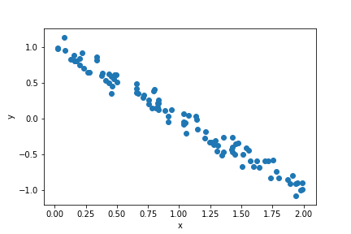
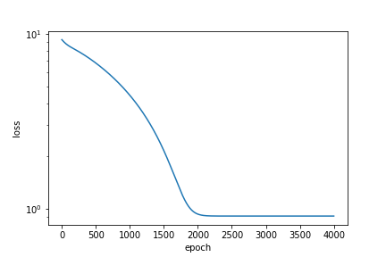
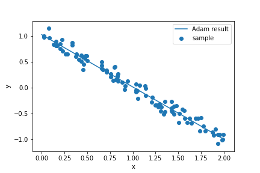
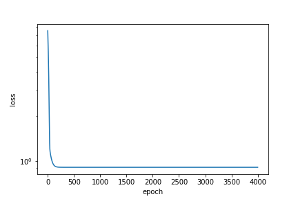
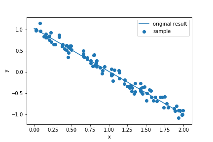

Pytorchを使った最適化の自分用メモ
===

関数ベースになったtensorflow2が使いづらいので，Pytorchに移行中．

パッケージをそのまま使う現代っ子ではなく，loss関数や最適化手法は自分で作りたいという懐古主義向けです．

勾配は手計算するものだという，化石は対象ではないです．

## データ生成

適当に生成

``` python 
import numpy as np
import matplotlib.pyplot as plt
import torch
from torch.autograd import Variable
import torch.optim as optim

N = 100
a_data =  - 1
b_data = 1
sigma_data = 0.1
x_data = 2 * np.random.rand(N)
y_data = a_data * x_data + b_data + sigma_data * np.random.randn(N)
```


## 最適化パッケージを使った場合

Loss関数を自分で作りたい，ひねくれた人向け.

```python
# 変数の定義
a = Variable(torch.randn(1), requires_grad=True)
b = Variable(torch.randn(1), requires_grad=True)

#データの変換
x_train = torch.tensor(x_data)
y_train = torch.tensor(y_data)

# 最適化関数の設定
optimizer = optim.Adam([a, b])

# 繰り返し回数
epoch = 4000

loss_epoch = np.zeros(epoch)

for i in range(epoch):
    #optimizerに使われていた勾配の初期化
    optimizer.zero_grad()
    #線形モデル
    y_hat = a * x_train + b
    #loss関数の計算
    loss = (y_train - y_hat).norm()
    loss_epoch[i] = loss.item()
    #勾配の設定
    loss.backward()
    #最適化の実行
    optimizer.step()
```
 

## 勾配のみ使う場合

Optimizerを使いたくない，もっとひねくれた人向け.
適当な勾配法をつかって最適化．

```python
# データ定義
a = torch.randn(1,requires_grad=True)
b = torch.randn(1,requires_grad=True)

#データの変換
x_train = torch.tensor(x_data)
y_train = torch.tensor(y_data)

# 学習率
eta = 0.001

# 繰り返し回数
epoch = 4000
loss_epoch = np.zeros(epoch)
for i in range(epoch):
    #勾配の記録開始
    a.requires_grad_(True)
    b.requires_grad_(True)
    #予測とloss関数の計算
    y_hat = a * x_train + b
    loss = (y_train - y_hat).norm()
    loss_epoch[i] = loss.item()
    #勾配の設定
    loss.backward()
    #勾配の記録停止
    a.requires_grad_(False)
    b.requires_grad_(False)

    #勾配を用いた更新 
    a = a - eta * a.grad
    b = b - eta * b.grad
```
 


## まとめ

勾配の記録と停止の部分を慣れたら使いやすそうですね．

## Code詳細
https://github.com/yuji0001/2020Introduction_of_Pytorch

## Reference
Pytorchのチュートリアルとか（[ここ](https://pytorch.org/tutorials/)）.

## Author 
Yuji Okamoto yuji.0001@gmail.com


